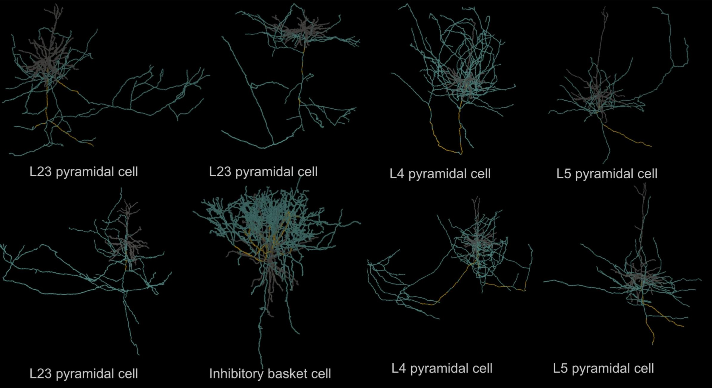

# Myelin Extraction Pipeline



This repository contains tools and pipelines for extracting myelin from the [MICrONS](https://www.microns-explorer.org/) dataset.

## Classifier Training

The classifiers used for myelin detection are stored in `DNN_classifiers` (model weights) and `classifiers.py` (classifier classes).  

These models were trained on annotation data using the following notebooks:
- `create_dataset_v2.ipynb`
- `make_test_train.ipynb`
- `train_test_model.ipynb`

You generally do **not** need to retrain the classifiers unless you want to:
- Improve performance
- Train on a new EM dataset

## Pipeline Overview

The main myelin extraction pipeline works as follows:

1. **Skeleton Point Selection**  
   - For each neuron, points are selected along the axon skeleton.  
   - If two adjacent skeleton points are more than *3 microns* apart (threshold adjustable), an additional point is inserted.

2. **Image Preprocessing**  
   - Compute the most perpendicular plane to the axon’s direction to obtain a circular cross-section.  
   - Identify the boundary of this cross-section from the segmentation mask.  
   - Unwrap the EM image along the contour to “straighten” the boundary.

3. **Classification**  
   - The processed image is classified using the trained DNN classifier.

## Usage

The helper functions for myelin extraction are provided in `myelin_extraction.py`.  

For batch extraction, use the notebook:  
- `Auto_myelin_v2.ipynb` → Calls `process_neurons()` in `myelin_extraction.py` to extract myelin for a list of neurons.

### Output Format

Results are stored in folders named: segments_myelin_{version}

where `{version}` refers to the client version (e.g., `1507`).

Each folder contains **extracted myelin traces in segments format**:
- Each segment corresponds to a portion of the axon between two branch points.
- Each segment includes sampled points along the axon and the classifier's myelin predictions.
- Only axonal segments are included (skeletons filtered accordingly).

## Activity Data Lookup by pt_root_id

### Overview
The repository also includes utilities for looking up functional activity data for specific neurons by their `pt_root_id`, without loading all scan files into RAM.

1. Uses the coregistration table (`coregistration_manual_v4`) to map `pt_root_id` → `unit_id`
2. Identifies which scan zip files contain the relevant units
3. Processes one zip file at a time (memory efficient!)
4. Extracts only the matching unit files from each zip
5. Returns a DataFrame with activity data

```python
from lookup_activity_by_pt_root_id import lookup_activity_by_pt_root_ids
from caveclient import CAVEclient
import pandas as pd

# 1. Load the coregistration table
client = CAVEclient('minnie65_public')
client.materialize.version = 1507
response = client.materialize.query_table('coregistration_manual_v4', return_df=False)
coregistration_df = pd.DataFrame(response)

# 2. Define pt_root_ids to look up
my_pt_root_ids = [864691135639261917, 864691136462442118, 864691135502068431]

# 3. Look up activity data (metadata only - fast)
results = lookup_activity_by_pt_root_ids(
    pt_root_ids=my_pt_root_ids,
    coregistration_df=coregistration_df,
    scan_dir='/path/to/scan/zip/files',
    return_full_data=False  # Just metadata
)

# 4. Get full traces if needed
results_full = lookup_activity_by_pt_root_ids(
    pt_root_ids=my_pt_root_ids,
    coregistration_df=coregistration_df,
    scan_dir='/path/to/scan/zip/files',
    return_full_data=True  # Include spike_trace and calcium_trace
)
```

### Quick Test

```bash
python test_lookup.py --scan_dir /path/to/scan/files --debug True
```

This will load the coregistration table, pick example pt_root_ids, look them up in the scan zip files, and display results.

## Connectivity Analysis

### Overview
The `connectivity_analysis/` directory contains tools for analyzing neural network connectivity patterns, including reciprocal connections and null model comparisons.

**Key Components:**
- `reciprocal_connectivity.py` - Analyze reciprocal connections in MICrONS data
- `null_model_core.py` - Simplified null model utilities
- `null_models/` - Full null model analysis package
- `data/` - Pre-computed connectivity matrices
- `notebooks/` - Jupyter notebooks for interactive analysis (`recip_connect.ipynb`, `null_model.ipynb`)

### Reciprocal Connectivity Analysis

Analyzes bidirectional (reciprocal) connections in the highly proofread V1 neural column from the MICrONS dataset.

```bash
cd connectivity_analysis
python reciprocal_connectivity.py --version 1507 --output-dir results
```

- Build connectivity matrices from synaptic data
- Identify reciprocal vs unidirectional connections
- Compare connection strengths (reciprocal typically stronger)
- Cell-type specific connectivity patterns

### Null Model Analysis

Compare real connectivity against null models to test statistical significance of network properties.

**Available Null Models:**
1. **Erdős-Rényi** - Completely random connectivity
2. **Generalized ER** - Preserves reciprocal edge count
3. **Degree-preserving** - Preserves in/out-degree distribution
4. **Cell-type preserving** - Maintains cell-type connectivity patterns

**Configuration (config.yaml):**
```yaml
data:
  adjacency_binary: "data/adjacency_binary_ordered.npy"
  reciprocal_matrix: "data/reciprocal_matrix.npy"

simulation:
  n_iterations: 1000  # Number of null networks
  random_seed: 42

models:
  erdos_renyi:
    enabled: true
    preserve_weights: true
```

### Data Files

Pre-computed connectivity matrices are provided in `connectivity_analysis/data/`:
- `adjacency_binary_ordered.npy` - Binary connectivity (1300×1300)
- `adjacency_weighted_ordered.npy` - Weighted by synapse count/size
- `reciprocal_matrix.npy` - Binary reciprocal connections
- `cell_type_indices.pkl` - Cell type to index mapping
- `cell_types.pkl` - Cell type labels


